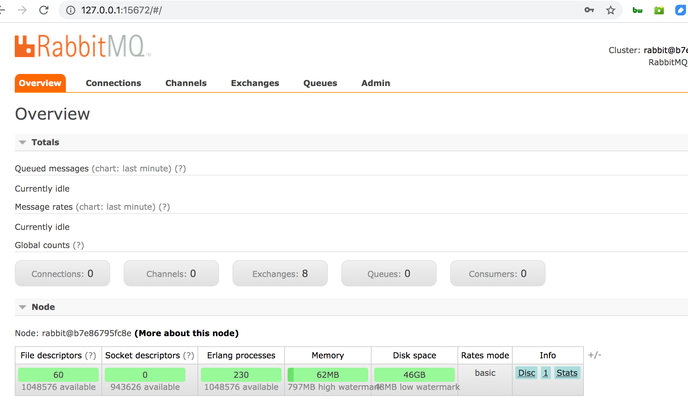

## 拉镜像：
```
docker pull rabbitmq:3.6.5
docker run -it -d --name rabbitmq -p 5672:5672 -p 15672:15672 rabbitmq:3.6.5
docker exec -it rabbitmq  bash
```

## 开启管理后台：
进入rabbitmq 容器 
```
docker exec -it rabbitmq  bash
```
替换密码：
```
sed -i  's/loopback_users, \[<<"guest">>]/loopback_users, [guest]/' /usr/lib/rabbitmq/lib/rabbitmq_server-3.6.5/ebin/rabbit.app
```
开启插件：
```
rabbitmq-plugins enable rabbitmq_management
```

## 看效果
用户名密码都是：guest


